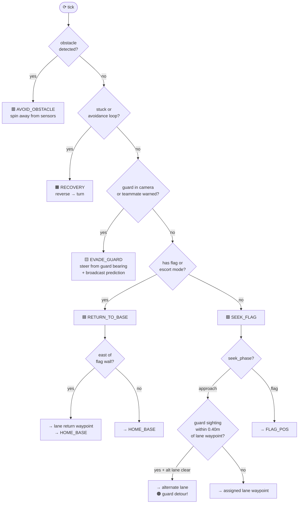
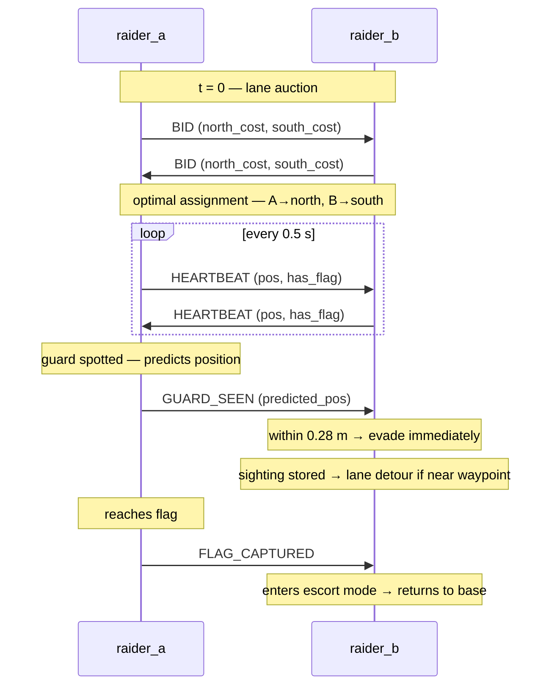

# PROWL-R

**Patrolling Robotic Observer with Wartime Logic & Response**

An asymmetric cooperative infiltration simulation built in [Webots R2025a](https://cyberbotics.com/) using e-puck robots. Two intelligent Raiders work together to steal a guarded flag and return it to base.

---

## Overview

| Robot | Count | Controller | Role |
|---|---|---|---|
| Raider (blue) | 2 | `raider_controller` | Cooperative, intelligent — captures flag and returns to base |
| Guard (yellow) | 1 | `guard_controller` | Scripted patrol — chases visible Raiders, no learning or comms |

The **red flag** sits behind a small wall at the east end of the arena. Raiders spawn at the west end. The Guard patrols north–south in front of the flag.

*Specialisation: Option C — Multi-Agent Coordination*

---

## Repository Structure

```
ProgrammingForRoboticsFinalAssignmentGC1/
├── worlds/
│   └── PROWL-R_V1.wbt
├── controllers/
│   ├── raider_controller/
│   │   └── raider_controller.py
│   └── guard_controller/
│       └── guard_controller.py
└── README.md
```

---

## Requirements

- [Webots R2025a](https://cyberbotics.com/#download)
- Python 3.x (bundled with Webots)
- No external dependencies

---

## Getting Started

1. Clone the repository
2. Open Webots and load `worlds/PROWL-R_V1.wbt`
3. Press **Play** — Raiders start the approach auction immediately

### VSCode setup (optional)

```json
{
  "python.analysis.extraPaths": [
    "C:\\Program Files\\Webots\\lib\\controller\\python"
  ],
  "python.defaultInterpreterPath": "C:\\Program Files\\Webots\\msys64\\mingw64\\bin\\python3.exe"
}
```

---

## Raider Behaviour Tree

Priority-ordered — highest condition that is true wins each timestep.

| Priority | State | Condition |
|---|---|---|
| 1 | `AVOID_OBSTACLE` | Side proximity sensors > 80 (latches for 30 ticks) |
| 2 | `RECOVERY` | Stuck > 3 s or avoidance loop > 3 s |
| 3 | `EVADE_GUARD` | Yellow pixels ≥ 20 in camera **or** teammate warns guard is within 0.28 m |
| 4 | `RETURN_TO_BASE` | Carrying flag **or** escort mode active |
| 5 | `SEEK_FLAG` | Default — navigate approach waypoint → flag |

When a Raider reaches its home base pad it stops. Once both Raiders are home the run ends.

**SEEK_FLAG rerouting** — on every tick in the approach phase, if a guard sighting (from own camera or teammate, within 2.5 s) is within 0.40 m of the assigned lane waypoint and the alternate lane is clear, the Raider steers toward the alternate waypoint instead. The on-screen route label turns orange and shows `[guard detour!]` when this fires.

**RETURN_TO_BASE path** — both the flag carrier and the escort route via a lane-side waypoint (north: `y=+0.32`, south: `y=-0.26`) before heading home when east of x=0.60, avoiding the flag wall at x=0.73.



---

## Guard Behaviour Tree

| Priority | State | Condition |
|---|---|---|
| 1 | `AVOID_OBSTACLE` | Side proximity sensors > 80 |
| 2 | `PATROL` | Default — compass north–south sweep |
| 3 | `CHASE` | Blue pixels ≥ 15 in camera — steers toward Raider; gives up after 5 s |

---

## Raider Coordination (Option C)

All messages are JSON strings on Emitter/Receiver channel 1. Each Raider ignores its own broadcasts.

| Message | When | What it does |
|---|---|---|
| `BID` | Once at t=0 | 2×2 Hungarian auction assigns each Raider a different approach lane (north or south of the flag wall) |
| `HEARTBEAT` | 2 Hz | Keeps SOLO-mode watchdog alive; triggers 1 s yield halt when Raiders are within 0.2 m |
| `GUARD_SEEN` | 2 Hz while evading | Predicted guard position broadcast to teammate; triggers immediate evade if within 0.28 m, and flags the nearby approach lane for rerouting (radius 0.40 m, TTL 2.5 s) |
| `FLAG_CAPTURED` | Once on grab | Teammate enters escort mode and returns to base; both stop on arrival |

**Failure handling** — no `BID` reply → take nearest lane; no heartbeat for 5 s → SOLO mode (coordination off, full BT still runs).



---

## Key Systems

- **Odometry** — encoder integration + compass heading; pose initialised to world spawn coordinates
- **Respawn** — tagged by Guard (>200 yellow pixels in camera) → `Supervisor` teleports Raider to spawn, flag dropped
- **Flag capture** — camera red-pixel detection gated by proximity to flag position (< 0.30 m) to prevent false positives
- **Guard position estimation** — bearing-based projection onto the guard's known patrol corridor (`x=0.30`): `gy = pose_y + (GUARD_PATROL_X − pose_x) × tan(bearing)`. Gives exact x and accurate y without relying on pixel count.
- **Guard velocity tracking** — direction changes require > 0.06 m displacement to update (hysteresis prevents single-observation flips); stationary detection after 1 s of no movement
- **Sighting tagging** — sightings are tagged `from_tm=True/False`. Proximity evade only fires on teammate sightings; waypoint rerouting uses both. This prevents a robot re-evading its own observations.
- **CSV logging** — each Raider writes `raider_<id>_mission.csv` (events: BID, AUCTION_RESULT, STATE, GUARD_SEEN, FLAG_CAPTURED, ESCORT_MODE, RESPAWN)
- **On-screen HUD** — per-robot labels show current state (white), comms summary (green), and active route with detour indicator (grey/orange)

---

## Team

Oscar Chia, Blair Fenton, Lakshay
